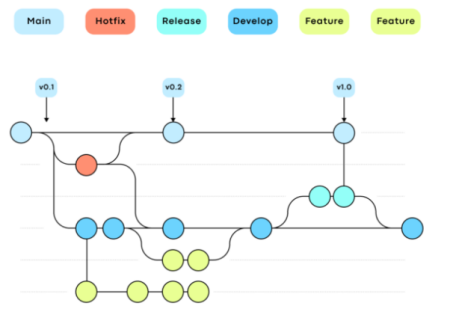
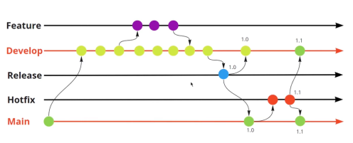
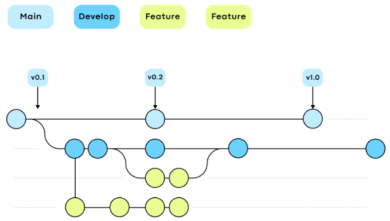

# Git

Git is a distributed version control system (DVCS) that allows developers to track changes in files. It is free, open-source, and was developed in 2005 by Linus Torvalds, the creator of the Linux kernel.

## Configuration

### Installation and initial config
```sh
# Install git
sudo apt install git-all
git --version

# Set your user name and email address
git config --global user.name "John Doe"
git config --global user.email johndoe@example.com

# Checking your settings
git config --list

# View all of your settings and where they are coming from
git config --list --show-origin
```

### Signing commits using SSH
```sh
# Create an ssh key on your machine
ssh-keygen -t ed25519 -C "email-here"

# Submit the public key to github signing key (you should already have an authentication key configured)

# Set Git to use SSH keys instead of traditional GPG to sign commits and tags.
git config --global gpg.format ssh

# Sets which public SSH key Git should use to sign commits and tags.
git config --global user.signingkey 'your public signing key'

# Enables auto-signing of all commits with the specified key.
git config --global commit.gpgsign true

# Enables automatic signing of all tags with your key.
git config --global tag.gpgsign true

# Start the SSH agent in the current terminal.
eval "$(ssh-agent -s)"

# Add your SSH private key to the SSH agent so Git can use it
ssh-add <your-private-key-id>
```

## Basic Commands

```sh
# Restore a file to a previous state (discarding/rejecting local changes)
git checkout -- file-name

# Change to a commit or an specific tag (without changing the branch)
git checkout <commit-hash>

# Creating a New Branch
git checkout -b <new-branch-name>

# Listing branches
git branch -r

# Deleting a Local Branch (If Merged)
git branch -d <branch-name>

# Forcibly Deleting a Local Branch
git branch -D <branch-name>

# Deleting a Remote Branch
git push origin --delete <branch-name>

# Updating Local References & Removing Deleted Remote Branches
git fetch --prune

# Pulling Remote Changes to Local
git pull origin <branch-name>

# Linking Local to Remote Repository
git remote add origin <repository-url>

# Merging Branches
git merge <branch-name>

# Pushing a New Branch & Opening a Pull Request
git push --set-upstream origin <new-branch-name>
# OR
git push -u origin <new-branch-name>

# Viewing Differences Between Local & Remote
git diff  # Press 'q' to exit

# Amending the Last Commit Message
git commit --amend -m "New comment"

# Viewing Differences in Staged Changes
git diff --staged  # Press 'q' to exit

# Resetting Local Changes to Remote State
git reset --hard origin/master
```

## Diverging local and remote branches

```sh
# 1. Merge: Merge the histories keeping all commits separate:
git pull --no-rebase

# Or set permanently:
git config pull.rebase false

# 2. Rebase (recommended for linear history): Rewrite local commits "over" remote commits:
git pull --rebase

# Or set permanently:
git config pull.rebase true

# 3. Fast-forward only (only if there is no divergence): Only allows pulling if there are no divergent local commits:
git pull --ff-only
```

## Delete a recent commit

```sh
git reset --hard HEAD~1
# Undoes the last commit and completely discards the changes, as if they had never been made.

git push --force
# This forces the reset to be pushed to the remote repository.
```

## Completely remove the commit history

```sh
# 1. Create a new orphan branch (it will be "orphaned," meaning it will have no relation to the existing branches)
git checkout --orphan new_branch

# 2. Add all files to the new branch (from the working directory to the staging area)
git add .
git commit -m "Initial commit after cleaning history"

# It creates an initial commit in the new branch, with a message indicating that the history has been cleaned.

# 3. Delete the main branch (usually "main" or "master"):
git branch -D main
git push origin --delete main

# It removes the main branch from the remote repository.

# 4. Rename the new branch to the old main branch:
git branch -m new_branch main

# It renames the new branch to the original main branch name.

# 5. Push the changes to the remote repository:
git push -f origin main

# It forces the new branch to be pushed to the remote repository, replacing the old history.
```

## Working with Tags
```sh
# Create a lightweight tag
git tag <tag-name>

# Create an annotated tag (with message and metadata)
git tag -a <tag-name> -m "Tag description"

# Show all tags in the repository
git tag

# Find tags that match a pattern
git tag -l "v1.*"

# Display information from an annotated tag
git show <tag-name>

# Create a tag for an old commit (replace <commit-hash> with the commit hash)
git tag -a <tag-name> <commit-hash> -m "Description"

# Send a single tag to the remote
git push origin <tag-name>

# Send all local tags to remote
git push --tags

# Excluir uma tag localmente
git tag -d <tag-name>

# Remove a tag from the remote repository
git push --delete origin <tag-name>

# Create a branch based on a tag (when working with releases)
git checkout -b <branch-name> <tag-name>

# View the difference between a tag and the current branch
git diff <tag-name>
```

## Advanced Commands

```sh
# Rebasing Local Changes with Remote History
git pull --rebase origin main

# Cherry-picking Commits Between Branches
git cherry-pick <commit-hash>

# Forcing a Push (Overwriting Remote History)
git push origin main --force

# Displaying Repository History in a Graph Format
git log --all --decorate --oneline --graph

# When a branch/tag has been removed on remote but still appears locally
git fetch --prune --tags
```
## Utilities

### Retrieve Remote Repository by Pushing a Local Repository

```sh
# In the terminal, inside your local repository folder
git remote add origin https://github.com/your-user/new-repository.git

# If an old origin already exists, you can overwrite it with
git remote set-url origin https://github.com/your-user/new-repository.git

# Push the content
git push -u origin main
```

# GitHub

GitHub is an online platform that hosts Git repositories and enables collaboration among developers. It functions like a social network for programmers, allowing users to:
1. Store and share projects.
2. Improve code through command-line tools, issue tracking, pull requests, and code reviews.
3. Maintain cloud-based projects and track progress.
4. Share knowledge with others.

# GitHub CLI

GitHub CLI is a command-line tool that allows interaction with GitHub directly from the terminal. It provides access to features like pull requests, issues, GitHub Actions, and more.

### Features:
- Manage repositories (view, create, clone, fork).
- Handle issues and pull requests (create, close, edit, list, merge, review, diff).
- Execute and manage GitHub Actions workflows.
- Manage releases and gists.
- Retrieve data from the GitHub API.

### Installation:
```sh
snap info gh

sudo snap install gh

gh help
```

### Basic Commands:

```sh
gh auth login

gh issue list

# Lists all issues with the ‘bug’ label
gh issue list --label "bug"

# Opens your browser to open the issue number 11
gh issue view 11

# Creates an issue from your cli
gh issue create

gh issue status
```

### Working with PR’s (Pull Requests):
```sh
gh pr --help

gh pr list

gh pr list -s "all"

gh pr status

# Checkout into the associated branch for pull request number 9
gh pr checkout 9

gh pr master/main

# Opens your browser to open pr 9
gh pr view 9

# Creates a new pr - but you should create a new branch before and finish your work
gh pr create

# Lists all the merged prs
gh pr list --state "merged"
```

# GitFlow Workflow

GitFlow is a branching model for managing a project's version control. It helps organize the development of new features, bug fixes, and releases efficiently.

## Workflow Structure





- The `develop` branch is the primary branch for development.
- Feature branches are created from `develop` and merged back once completed.
- Releases are created from `develop`, tested, and merged into `main`.
- Hotfixes are created directly from `main` for urgent fixes.
- Changes from `release` and `hotfix` branches must be reflected in `develop`.

### Summary:
1. `develop` is created from `main`.
2. `release` branches are created from `develop`.
3. Feature branches are created from `develop`.
4. Features are merged into `develop`.
5. Releases are merged into both `main` and `develop`.
6. Hotfixes are created from `main`, then merged back into `main` and `develop`.

## Commands:

### Basic GitFlow Commands

```sh
# Initialize GitFlow
git flow init

# Start a Feature Branch
git flow feature start <feature-name>

# Finish a Feature Branch
git flow feature finish <feature-name>

# Publish a Feature Branch
git flow feature publish <feature-name>

# Start a Release
git flow release start 1.0

# Finish a Release
git flow release finish 1.0

# Start a Hotfix
git flow hotfix start 1.1

# Finish a Hotfix
git flow hotfix finish 1.1

# Push All Local Branches to GitHub
git push --all
```

### Commands if you mistakenly pushed a wrong tag to the remote

#### You can create a new tag to fix the version
```sh
git tag # Lists local tags
git ls-remote --tags origin # Lists remote tags

# To create a new tag to fix the version
git tag <new-tag> <current-tag>

# Upload the new tag to the remote repository
git push origin <new-tag>

# Delete the local wrong tag
git tag -d <wrong-tag>

# Delete from remote repository
git push origin --delete <wrong-tag>
```

#### Or you can revert and recreate the release (if you haven't pushed it yet)
```sh
# To remove the last commit from main (which came from release)
git checkout main
git reset --hard HEAD~1  # Reverts back to before the release

# To remove the last commit from develop (if release was merged into it as well)
git checkout develop
git reset --hard HEAD~1

# Delete the wrong tag and redo the release
git tag -d <wrong-tag>  # Removes the local wrong tag
git flow release start <new-tag>

# Correctly finalize the release (now with the correct tag)
git flow release finish <new-tag>
```

#### Utimately, you can go back to an earlier commit and delete later commits (permanently)
```sh
git reset --hard <old_commit_hash>
# The --hard erases subsequent changes.

git push origin main --force
# The --force is necessary because you are overwriting the remote history.

# If you prefer, you can go back to a previous commit, but without deleting files from your directory
git reset --soft <old_commit_hash>
# It keeps the files as they are, but returns the HEAD pointer to the chosen commit.
#The following commits disappear from the history, but the changes remain in the staging area.
```
